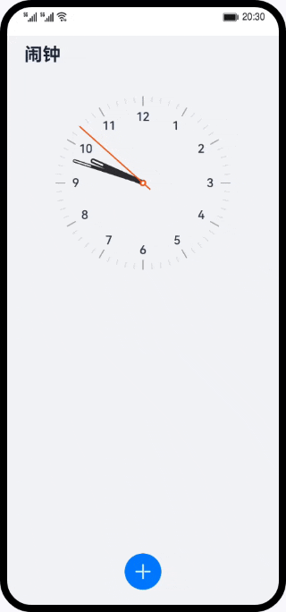

# 闹钟（ArkTS）

## 简介

基于ArkTS的声明式开发范式及HarmonyOS的后台代理提醒能力，实现简单的闹钟提醒功能。

最终效果图如图所示：



## 相关概念

- [Canvas](https://developer.harmonyos.com/cn/docs/documentation/doc-guides-V3/arkts-drawing-customization-on-canvas-0000001453684976-V3?catalogVersion=V3): 提供画布组件，用于自定义绘制图形。

- [CanvasRenderingContext2D](https://developer.harmonyos.com/cn/docs/documentation/doc-references-V3/ts-canvasrenderingcontext2d-0000001478181441-V3?catalogVersion=V3): 使用RenderingContext在Canvas组件上进行绘制，绘制对象可以是矩形、文本、图片等。

- [后台代理提醒](https://developer.harmonyos.com/cn/docs/documentation/doc-guides-V3/agent-powered-reminder-0000001663585481-V3?catalogVersion=V3): 开发应用时，开发者可以调用后台提醒发布的接口创建定时提醒，包括倒计时、日历、闹钟三种提醒类型。使用后台代理提醒能力后，应用可以被冻结或退出，计时和弹出提醒的功能将被后台系统服务代理。本应用中主要使用到后台代理提醒的两个接口：

    -   **publishReminder**

          发布一个后台代理提醒，使用callback方式实现异步调用，该方法需要申请通知弹窗Notification.requestEnableNotification后才能调用。

    -   **cancelReminder**

          取消指定id的提醒，使用callback方式实现异步调用。

## 相关权限

本篇Codelab需要在module.json5中配置如下权限：

```
"requestPermissions": [
  {
    "name": "ohos.permission.PUBLISH_AGENT_REMINDER",
    "reason": "$string:reason",
    "usedScene": {
      "abilities": [
        "EntryAbility"
      ],
      "when": "inuse"
    }
  }
]
```

## 使用说明
1. 打开应用，添加一个闹钟，闹钟到设定的时间后弹出提醒。
2. 修改闹钟的时间，闹钟到设定的时间后弹出提醒。
3. 删除闹钟。
4. 展示闹钟列表，并可打开和关闭单个闹钟。

## 约束与限制

1. 本示例仅支持标准系统上运行，支持设备：华为手机或运行在DevEco Studio上的华为手机设备模拟器。
2. 本示例为Stage模型，支持API version 9及以上版本SDK。
3. 本示例需要使用DevEco Studio 3.1 Release及以上版本进行编译运行。

