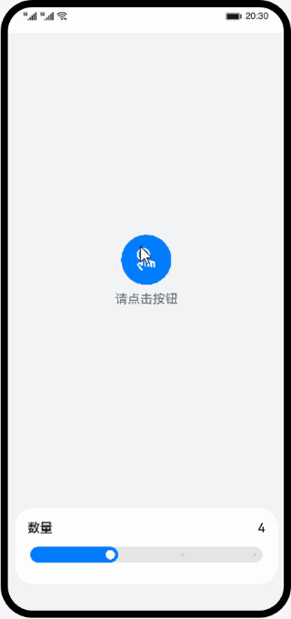

# 动效示例（ArkTS）
### 简介
利用ArkTS为组件的属性添加过渡的动态效果，提升用户体验。
 
本篇codeLab实现如下功能
- 点击动画触发按钮，动画图标会由中心旋转而出，再次点击中心按钮，动画图标将由四周缩回。
- 点击单个图标会触发图标的缩放、旋转、透明度变化的动画效果。
- 调节滑动条会控制动画图标的数量，最少三个，最多六个。
 
最终效果图如下:
 

 
### 相关概念 
 
- [显式动画](https://developer.harmonyos.com/cn/docs/documentation/doc-references-V3/ts-explicit-animation-0000001478341181-V3?catalogVersion=V3)：提供全局animateTo显式动画接口来指定由于闭包代码导致的状态变化插入过渡动效。
 
- [属性动画](https://developer.harmonyos.com/cn/docs/documentation/doc-references-V3/ts-animatorproperty-0000001478181445-V3?catalogVersion=V3)：组件的某些通用属性变化时，可以通过属性动画实现渐变过渡效果，提升用户体验。支持的属性包括width、height、backgroundColor、opacity、scale、rotate、translate等。
 
- [Slider](https://developer.harmonyos.com/cn/docs/documentation/doc-references-V3/ts-basic-components-slider-0000001427744820-V3?catalogVersion=V3)：滑动条组件，通常用于快速调节设置值，如音量调节、亮度调节等应用场景。

 
### 使用说明
1. 进入首页点击按钮会有相应数量的图标由中心旋转而出，再次点击突变会由四周旋转缩回原点。
2. 滑动下方滑动条控制动画图标数量，最少显示3个动画图标，最多6个。
3. 点击单个图标会有旋转、透明度变化的动画效果。
 
 
### 约束与限制
1. 本示例仅支持标准系统上运行，支持设备：华为手机或运行在DevEco Studio上的华为手机设备模拟器。
2. 本示例为Stage模型，支持API version 9版本SDK。
3. 本示例需要使用DevEco Studio 3.1 Release版本进行编译运行。