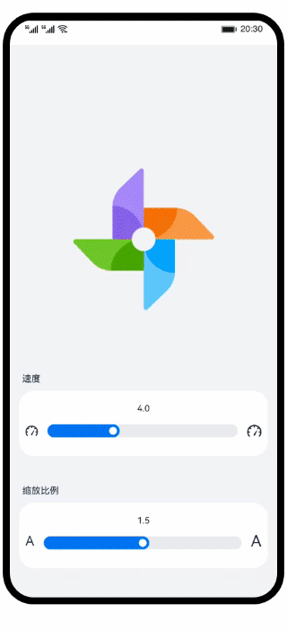

# 基础组件Slider的使用（ArkTS）
### 简介
使用Slider组件，实现了可调节风车大小和转速的动画效果。效果图如下：


### 相关概念
- Text组件：文本组件，用于呈现一段信息。
- Image组件：图片组件，用来渲染展示图片。
- Slider组件：滑动条组件，用来快速调节设置值，如音量、亮度等。
#### 组件和装饰器
- 在声明式UI中，所有的页面都是由组件构成。组件的数据结构为struct，装饰器@Component是组件化的标志，用@Component修饰的struct表示这个结构体有了组件化的能力。自定义组件的声明方式为：
  ``` @Component  
  struct MyComponent {}
  ```
  @Entry修饰的Component表示该Component是页面的总入口，也可以理解为页面的根节点。值得注意的是，一个页面有且仅能有一个@Entry，只有被@Entry修饰的组件或者其子组件，才会在页面上显示。@Component和@Entry都是基础且十分重要的装饰器。简单地理解，装饰器就是某一种修饰，给被装饰的对象赋予某一种能力，比如@Entry就是页面入口的能力，@Component就是组件化能力。
### 相关权限
不涉及
### 使用说明
1. 拖动速度滚动条，可以调节风车旋转速度。
2. 拖动缩放比例滚动条，可以调节风车大小。
### 约束与限制
1. 本示例仅支持标准系统上运行，支持设备：华为手机或运行在DevEco Studio上的华为手机设备模拟器。
2. 本示例为Stage模型，支持API version 9及以上版本SDK。
3. 本示例需要使用DevEco Studio 3.0 Beta4及以上版本进行编译运行。

