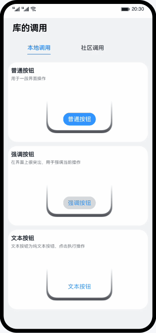

# 库的调用（ArkTS）

### 简介

本篇Codelab主要向开发者展示了在Stage模型中，如何调用已经上架到三方库中心的社区库和项目内创建的本地库。

最终效果图如下：

### 相关概念

[Navigation](https://developer.harmonyos.com/cn/docs/documentation/doc-references/ts-basic-components-navigation-0000001333800549)：一般作为Page页面的根容器，通过属性设置来展示页面的标题、工具栏、菜单。

[Tabs](https://developer.harmonyos.com/cn/docs/documentation/doc-references/ts-container-tabs-0000001281001258)：一种可以通过页签进行内容视图切换的容器组件，每个页签对应一个内容视图。

[Canvas](https://developer.harmonyos.com/cn/docs/documentation/doc-references/ts-components-canvas-canvas-0000001333641081)：画布组件，用于自定义绘制图形。

[HarmonyOS npm包](https://developer.harmonyos.com/cn/docs/documentation/doc-guides/creating_har_api8-0000001341502357)：在传统的npm三方包的基础上，定义了HarmonyOS npm共享包特定的工程结构和配置文件，支持HarmonyOS页面组件、相关API、资源的调用。

### 使用说明

1. 进入首页可以看见本地调用和社区调用两个tab页。
2. 点击本地调用tab可以看见三个本地库的展示按钮。
3. 点击社区调用tab切换页面可以看见调用的社区库动画，上半部分为Canvas画布，下方为操作按钮，可以点击对应按钮操作动画特效。

### 约束与限制

1. 本示例仅支持标准系统上运行，支持设备：华为手机或运行在DevEco Studio上的华为手机设备模拟器。
2. 本示例为Stage模型，支持API version 9及以上版本SDK。
3. 本示例需要使用DevEco Studio 3.0 Beta4及以上版本进行编译运行。