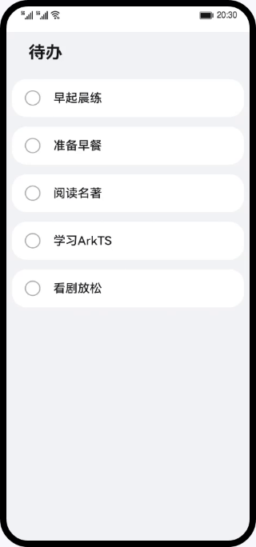

# 待办列表（ArkTS）

## 简介
本篇Codelab基于ArkTS声明式语法和ArkTS基础组件，实现简易待办事项的案例。效果图如下：

## 相关概念

- [ArkTS语法](https://developer.harmonyos.com/cn/docs/documentation/doc-guides-V3/arkts-get-started-0000001504769321-V3?catalogVersion=V3): ArkTS是HarmonyOS的主要应用开发语言。ArkTS基于TypeScript（简称TS）语言扩展而来，是TS的超集。

- [Text组件](https://developer.harmonyos.com/cn/docs/documentation/doc-references-V3/ts-basic-components-text-0000001477981201-V3?catalogVersion=V3): 显示一段文本的组件。

- [Column组件](https://developer.harmonyos.com/cn/docs/documentation/doc-references-V3/ts-container-column-0000001478341157-V3?catalogVersion=V3): 沿垂直方向布局的容器。

- [Row组件](https://developer.harmonyos.com/cn/docs/documentation/doc-references-V3/ts-container-row-0000001478061717-V3?catalogVersion=V3): 沿水平方向布局的容器。

## 相关权限

不涉及

## 使用说明

1. 打开应用首页，点击列表中的待办事项，标记完成此待办事项。

## 约束与限制

1. 本示例仅支持标准系统上运行，支持设备：华为手机或运行在DevEco Studio上的华为手机设备模拟器。
2. 本示例为Stage模型，支持API version 9及以上版本SDK。
3. 本示例需要使用DevEco Studio 3.1 Release及以上版本进行编译运行。